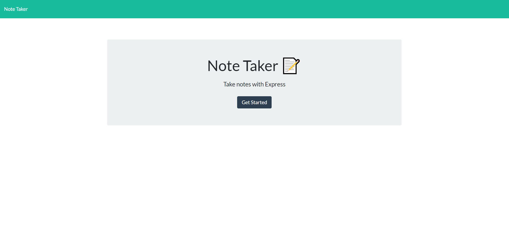
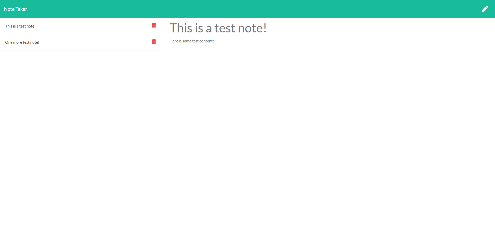

# Unit 11 Express Homework: Note Taker

## Links
[GitHub](https://github.com/ChristianPayne/HW09-NoteTaker)

[Deployed Application](https://frozen-peak-61058.herokuapp.com/)

## User Story

AS A user, I want to be able to write and save notes

I WANT to be able to delete notes I've written before

SO THAT I can organize my thoughts and keep track of tasks I need to complete

## Business Context

For users that need to keep track of a lot of information, it's easy to forget or be unable to recall something important. Being able to take persistent notes allows users to have written information available when needed.

## Screenshots

